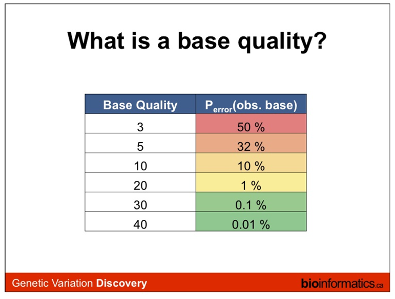
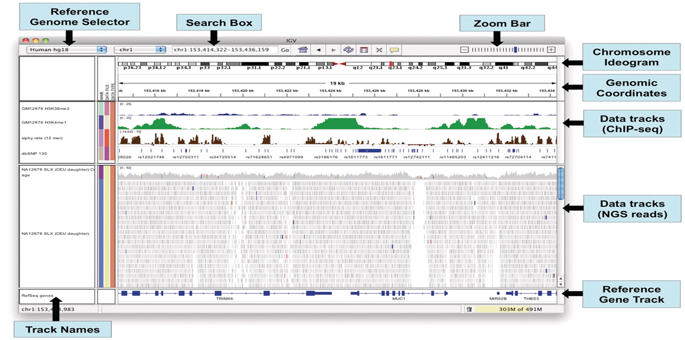
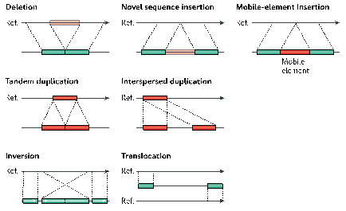
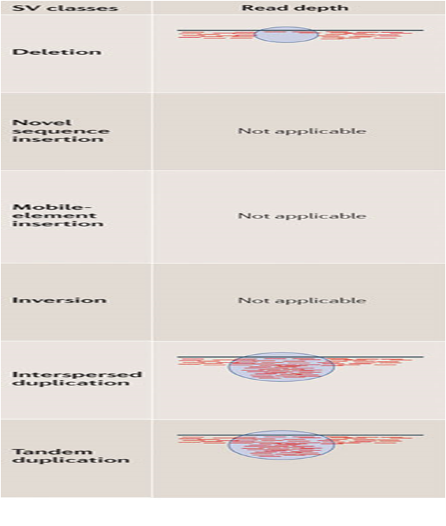
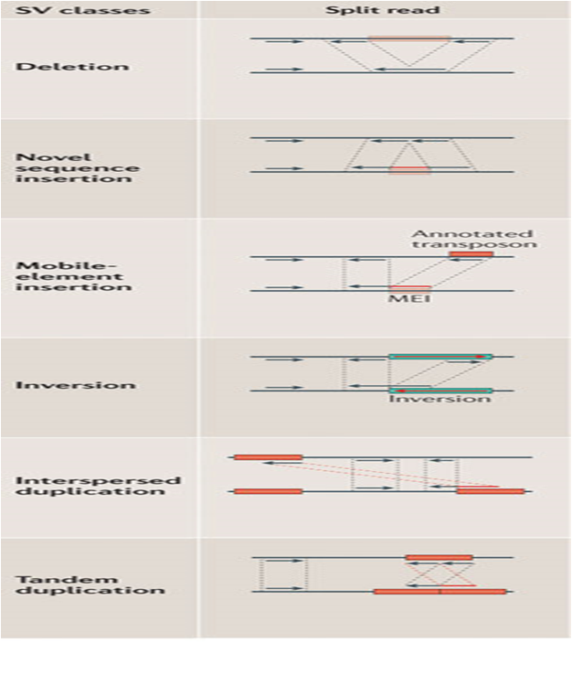
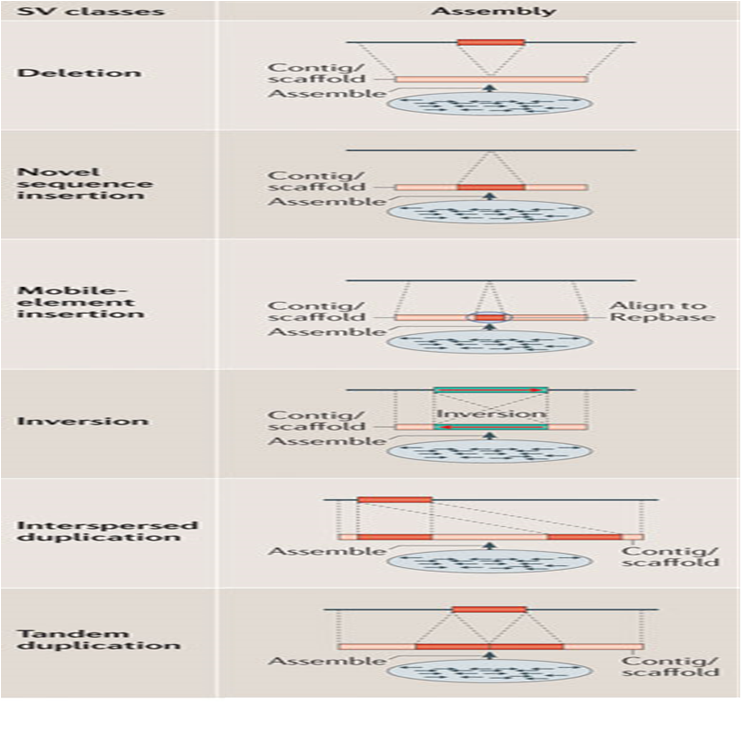
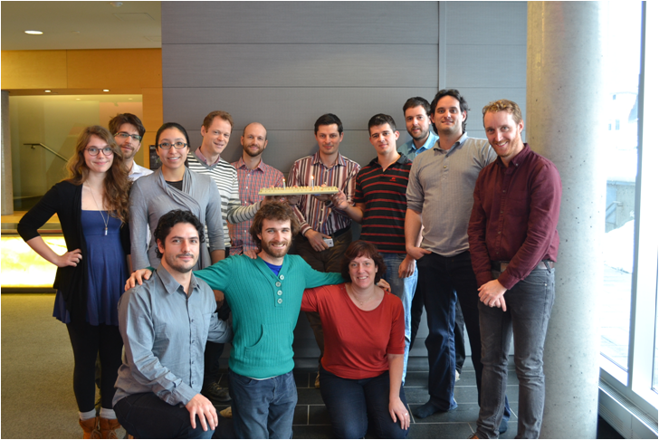

# Introduction to DNA-Seq processing
***By Mathieu Bourgey, Ph.D***

In this workshop, we will present the main steps that are commonly used to process and to analyze sequencing data. We will focus only on whole genome data and provide command lines that allow detecting Single Nucleotide Variants (SNV), for a question of time we will only present the rational for the detection of Structural Variant (SV including CNV). This workshop will show you how to launch individual steps of a complete DNA-Seq pipeline

We will be working on a 1000 genome sample, NA12878. You can find the whole raw data on the 1000 genome website:
http://www.1000genomes.org/data

For practical reasons we subsampled the reads from the sample because running the whole dataset would take way too much time and resources.

This work is licensed under a [Creative Commons Attribution-ShareAlike 3.0 Unported License](http://creativecommons.org/licenses/by-sa/3.0/deed.en_US). This means that you are able to copy, share and modify the work, as long as the result is distributed under the same license.

## Original Setup

The initial structure of your folders should look like this:
```
<ROOT>
|-- raw_reads/               # fastqs from the center (down sampled)
    `-- NA12878              # One sample directory
        |-- runERR_1         # Lane directory by run number. Contains the fastqs
        `-- runSRR_1         # Lane directory by run number. Contains the fastqs
```

### Cheat file
* You can find all the unix command lines of this practical in the file: commands.sh


### Environment setup
```
export PICARD_JAR=/usr/local/bin/picard.jar 
export SNPEFF_HOME=/usr/local/src/snpEff/  
export GATK_JAR=/usr/local/bin/GenomeAnalysisTK.jar
export BVATOOLS_JAR=/usr/local/bin/bvatools-1.4-full.jar 
export TRIMMOMATIC_JAR=/usr/local/bin/trimmomatic-0.33.jar 
export REF=/home/mBourgey/kyoto_workshop_WGS_2015/references/ 

cd $HOME 
rsync -avP /home/mBourgey/cleanCopy/ $HOME/workshop 
cd $HOME/workshop/
```

### Software requirements
These are all already installed, but here are the original links.

  * [Trimmomatic](http://www.usadellab.org/cms/?page=trimmomatic)
  * [BVATools](https://bitbucket.org/mugqic/bvatools/downloads)
  * [SAMTools](http://sourceforge.net/projects/samtools/)
  * [IGV](http://www.broadinstitute.org/software/igv/download)
  * [BWA](http://bio-bwa.sourceforge.net/)
  * [Genome Analysis Toolkit](http://www.broadinstitute.org/gatk/)
  * [Picard](http://picard.sourceforge.net/)
  * [SnpEff](http://snpeff.sourceforge.net/)


# First data glance
So you've just received an email saying that your data is ready for download from the sequencing center of your choice.

**What should you do ?** (for solution see section: solutions_data)


### Fastq files
Let's first explore the fastq file.

Try these commands

```
zless -S raw_reads/NA12878/runSRR_1/NA12878.SRR.33.pair1.fastq.gz

```

**Why was it like that ?** (for solution see section: solutions_fastq1)


Now try these commands:

```
zcat raw_reads/NA12878/runSRR_1/NA12878.SRR.33.pair1.fastq.gz | head -n4
zcat raw_reads/NA12878/runSRR_1/NA12878.SRR.33.pair2.fastq.gz | head -n4
```

**What was special about the output ?**

**Why was it like that?** (for solution see section: solutions_fastq2)

You could also just count the reads

```
zgrep -c "^@SRR" raw_reads/NA12878/runSRR_1/NA12878.SRR.33.pair1.fastq.gz
```

We should obtain 15546 reads

**Why shouldn't you just do ?** 

```
zgrep -c "^@" raw_reads/NA12878/runSRR_1/NA12878.SRR.33.pair1.fastq.gz
```

(for solution see section: solutions_fastq3)


### Quality
We can't look at all the reads. Especially when working with whole genome 30x data. You could easily have Billions of reads.

Tools like FastQC and BVATools readsqc can be used to plot many metrics from these data sets.

Let's look at the data:

```
mkdir originalQC/
java -Xmx1G -jar ${BVATOOLS_JAR} readsqc \
  --read1 raw_reads/NA12878/runSRR_1/NA12878.SRR.33.pair1.fastq.gz \
  --read2 raw_reads/NA12878/runSRR_1/NA12878.SRR.33.pair2.fastq.gz \
  --threads 2 --regionName SRR --output originalQC/

java -Xmx1G -jar ${BVATOOLS_JAR} readsqc \
  --read1 raw_reads/NA12878/runERR_1/NA12878.ERR.33.pair1.fastq.gz \
  --read2 raw_reads/NA12878/runERR_1/NA12878.ERR.33.pair2.fastq.gz \
  --threads 2 --regionName ERR --output originalQC/
```

Copy the images from the originalQC folder to your desktop and open the images.

```
scp -r <USER>@www.genome.med.kyoto-u.ac.jp:~/workshop/originalQC/ ./
```

Open the images

**What stands out in the graphs ?**
(for solution see section: solutions_fastqQC1)

All the generated graphics have their uses. But 2 of them are particularly useful to get an overal picture of how good or bad a run went.
	- The Quality box plots 
	- The nucleotide content graphs.
	- The Box plot shows the quality distribution of your data.
 
The quality of a base is computated using the Phread quality score.
(for note see section: notes_fastQC1) 


The quality of a base is computated using the Phread quality score.


In the case of base quality the probability use represents the probability of base to have been wrongly called


The formula outputs an integer that is encoded using an ASCII table. 

The way the lookup is done is by taking the the phred score adding 33 and using this number as a lookup in the table.

Older illumina runs were using phred+64 instead of phred+33 to encode their fastq files.


Of the raw data we see that:
 
   - Some reads have bad 3' ends.
   - Some reads have adapter sequences in them.

**Why do we see adapters in SRR ?** (for solution see section: solutions_adapter1)

Although nowadays this doesn't happen often, it does still happen. In some cases, miRNA, it is expected to have adapters.


### Trimming
Since adapter are not part of the genome they should be removed

To do that we will use Trimmomatic.
 
The adapter file is in your work folder. 

```
cat adapters.fa
```

**Why are there 2 different ones ?** (for solution see section: solutions_trim1)


trimming with trimmomatic:


```
mkdir -p reads/NA12878/runSRR_1/
mkdir -p reads/NA12878/runERR_1/

java -Xmx2G -cp $TRIMMOMATIC_JAR org.usadellab.trimmomatic.TrimmomaticPE -threads 2 -phred33 \
  raw_reads/NA12878/runERR_1/NA12878.ERR.33.pair1.fastq.gz \
  raw_reads/NA12878/runERR_1/NA12878.ERR.33.pair2.fastq.gz \
  reads/NA12878/runERR_1/NA12878.ERR.t20l32.pair1.fastq.gz \
  reads/NA12878/runERR_1/NA12878.ERR.t20l32.single1.fastq.gz \
  reads/NA12878/runERR_1/NA12878.ERR.t20l32.pair2.fastq.gz \
  reads/NA12878/runERR_1/NA12878.ERR.t20l32.single2.fastq.gz \
  ILLUMINACLIP:adapters.fa:2:30:15 TRAILING:20 MINLEN:32 \
  2> reads/NA12878/runERR_1/NA12878.ERR.trim.out

java -Xmx2G -cp $TRIMMOMATIC_JAR org.usadellab.trimmomatic.TrimmomaticPE -threads 2 -phred33 \
  raw_reads/NA12878/runSRR_1/NA12878.SRR.33.pair1.fastq.gz \
  raw_reads/NA12878/runSRR_1/NA12878.SRR.33.pair2.fastq.gz \
  reads/NA12878/runSRR_1/NA12878.SRR.t20l32.pair1.fastq.gz \
  reads/NA12878/runSRR_1/NA12878.SRR.t20l32.single1.fastq.gz \
  reads/NA12878/runSRR_1/NA12878.SRR.t20l32.pair2.fastq.gz \
  reads/NA12878/runSRR_1/NA12878.SRR.t20l32.single2.fastq.gz \
  ILLUMINACLIP:adapters.fa:2:30:15 TRAILING:20 MINLEN:32 \
  2> reads/NA12878/runSRR_1/NA12878.SRR.trim.out

cat reads/NA12878/runERR_1/NA12878.ERR.trim.out reads/NA12878/runSRR_1/NA12878.SRR.trim.out
```

(for note see section: notes_trimmomatic)

**What does Trimmomatic says it did ?** (for solution see section: solutions_trim2)

Let's look at the graphs now

```
mkdir postTrimQC/
java -Xmx1G -jar ${BVATOOLS_JAR} readsqc \
  --read1 reads/NA12878/runERR_1/NA12878.ERR.t20l32.pair1.fastq.gz \
  --read2 reads/NA12878/runERR_1/NA12878.ERR.t20l32.pair2.fastq.gz \
  --threads 2 --regionName ERR --output postTrimQC/
java -Xmx1G -jar ${BVATOOLS_JAR} readsqc \
  --read1 reads/NA12878/runSRR_1/NA12878.SRR.t20l32.pair1.fastq.gz \
  --read2 reads/NA12878/runSRR_1/NA12878.SRR.t20l32.pair2.fastq.gz \
  --threads 2 --regionName SRR --output postTrimQC/
```

**How does it look now ?** (for solution see section: solutions_trim3)


# Alignment
The raw reads are now cleaned up of artefacts we can align each lane separatly.

**Why should this be done separatly?** (for solution see section: solutions_aln1)

**Why is it important to set Read Group information ?** (for solution see section: solutions_aln2)

##Alignment with bwa-mem

```
mkdir -p alignment/NA12878/runERR_1
mkdir -p alignment/NA12878/runSRR_1

bwa mem -M -t 2 \
  -R '@RG\tID:ERR_ERR_1\tSM:NA12878\tLB:ERR\tPU:runERR_1\tCN:Broad Institute\tPL:ILLUMINA' \
  ${REF}/b37.fasta \
  reads/NA12878/runERR_1/NA12878.ERR.t20l32.pair1.fastq.gz \
  reads/NA12878/runERR_1/NA12878.ERR.t20l32.pair2.fastq.gz \
  | java -Xmx2G -jar ${PICARD_JAR} SortSam \
  INPUT=/dev/stdin \
  OUTPUT=alignment/NA12878/runERR_1/NA12878.ERR.sorted.bam \
  CREATE_INDEX=true VALIDATION_STRINGENCY=SILENT SORT_ORDER=coordinate MAX_RECORDS_IN_RAM=500000

bwa mem -M -t 2 \
  -R '@RG\tID:SRR_SRR_1\tSM:NA12878\tLB:SRR\tPU:runSRR_1\tCN:Broad Institute\tPL:ILLUMINA' \
  ${REF}/b37.fasta \
  reads/NA12878/runSRR_1/NA12878.SRR.t20l32.pair1.fastq.gz \
  reads/NA12878/runSRR_1/NA12878.SRR.t20l32.pair2.fastq.gz \
  | java -Xmx2G -jar ${PICARD_JAR} SortSam \
  INPUT=/dev/stdin \
  OUTPUT=alignment/NA12878/runSRR_1/NA12878.SRR.sorted.bam \
  CREATE_INDEX=true VALIDATION_STRINGENCY=SILENT SORT_ORDER=coordinate MAX_RECORDS_IN_RAM=500000
```
 
**Why did we pipe the output of one to the other ?** (for solution see section: solutions_aln3)

**Could we have done it differently ?** (for solution see section: solutions_aln4)

We will explore the generated BAM latter if we get enough time.

## Lane merging
We now have alignments for each of the sequences lanes:
 
   - This is not practical in it's current form. 
   - What we wan't to do now is merge the results into one BAM.

Since we identified the reads in the BAM with read groups, even after the merging, we can still identify the origin of each read.


```
java -Xmx2G -jar ${PICARD_JAR} MergeSamFiles \
  INPUT=alignment/NA12878/runERR_1/NA12878.ERR.sorted.bam \
  INPUT=alignment/NA12878/runSRR_1/NA12878.SRR.sorted.bam \
  OUTPUT=alignment/NA12878/NA12878.sorted.bam \
  VALIDATION_STRINGENCY=SILENT CREATE_INDEX=true
``` 

You should now have one BAM containing all your data.

Let's double check

```
ls -l alignment/NA12878/
samtools view -H alignment/NA12878/NA12878.sorted.bam | grep "^@RG"

```

You should have your 2 read group entries.

**Why did we use the -H switch? ** (for solution see section: solutions_merge1)

**Try without. What happens?** (for solution see section: solutions_merge2)

(for note see section: notes_merge1)


# Cleaning up alignments
We started by cleaning up the raw reads. Now we need to fix some alignments.

The first step for this is to realign around indels and snp dense regions.

The Genome Analysis toolkit has a tool for this called IndelRealigner.

It basically runs in 2 steps:
 
   1. Find the targets
   2. Realign them
	

##GATK IndelRealigner

```
java -Xmx2G  -jar ${GATK_JAR} \
  -T RealignerTargetCreator \
  -R ${REF}/b37.fasta \
  -o alignment/NA12878/realign.intervals \
  -I alignment/NA12878/NA12878.sorted.bam \
  -L 1

java -Xmx2G -jar ${GATK_JAR} \
  -T IndelRealigner \
  -R ${REF}/b37.fasta \
  -targetIntervals alignment/NA12878/realign.intervals \
  -o alignment/NA12878/NA12878.realigned.sorted.bam \
  -I alignment/NA12878/NA12878.sorted.bam

```

**How could we make this go faster ?** (for solution see section: solutions_realign1)

**How many regions did it think needed cleaning ?** (for solution see section: solutions_realign2)


## FixMates
Why ?
  
   - Some read entries don't have their mate information written properly.

We use Picard to do this:

```
java -Xmx2G -jar ${PICARD_JAR} FixMateInformation \
  VALIDATION_STRINGENCY=SILENT CREATE_INDEX=true SORT_ORDER=coordinate MAX_RECORDS_IN_RAM=500000 \
  INPUT=alignment/NA12878/NA12878.realigned.sorted.bam \
  OUTPUT=alignment/NA12878/NA12878.matefixed.sorted.bam
```

## Mark duplicates
**What are duplicate reads ?** (for solution see section: solutions_markdup1)

**What are they caused by ?** (for solution see section: solutions_markdup2)

**What are the ways to detect them ?** (for solution see section: solutions_markdup3)

Here we will use picards approach:

```
java -Xmx2G -jar ${PICARD_JAR} MarkDuplicates \
  REMOVE_DUPLICATES=false CREATE_MD5_FILE=true VALIDATION_STRINGENCY=SILENT CREATE_INDEX=true \
  INPUT=alignment/NA12878/NA12878.matefixed.sorted.bam \
  OUTPUT=alignment/NA12878/NA12878.sorted.dup.bam \
  METRICS_FILE=alignment/NA12878/NA12878.sorted.dup.metrics
```

We can look in the metrics output to see what happened.

```
less alignment/NA12878/NA12878.sorted.dup.metrics
```

**How many duplicates were there ?** (for solution see section: solutions_markdup4)

We can see that it computed separate measures for each library.
 
**Why is this important to do not combine everything ?** (for solution see section: solutions_markdup5)

(for note see section: notes_mardup1)

## Base Quality recalibration
**Why do we need to recalibrate base quality scores ?** (for solution see section: solutions_recal1)

GATK BaseRecalibrator:

```
java -Xmx2G -jar ${GATK_JAR} \
  -T BaseRecalibrator \
  -nct 2 \
  -R ${REF}/b37.fasta \
  -knownSites ${REF}/dbSnp-137.vcf.gz \
  -L 1:47000000-47171000 \
  -o alignment/NA12878/NA12878.sorted.dup.recalibration_report.grp \
  -I alignment/NA12878/NA12878.sorted.dup.bam

java -Xmx2G -jar ${GATK_JAR} \
  -T PrintReads \
  -nct 2 \
  -R ${REF}/b37.fasta \
  -BQSR alignment/NA12878/NA12878.sorted.dup.recalibration_report.grp \
  -o alignment/NA12878/NA12878.sorted.dup.recal.bam \
  -I alignment/NA12878/NA12878.sorted.dup.bam
```


# Extract BAM metrics
Once your whole bam is generated, it's always a good thing to check the data again to see if everything makes sens.

**Compute coverage**
If you have data from a capture kit, you should see how well your targets worked

**Insert Size**
It tells you if your library worked

**Alignment metrics**
It tells you if your sample and you reference fit together

## Compute coverage
Both GATK and BVATools have depth of coverage tools. 

Here we'll use the GATK one

```
java  -Xmx2G -jar ${GATK_JAR} \
  -T DepthOfCoverage \
  --omitDepthOutputAtEachBase \
  --summaryCoverageThreshold 10 \
  --summaryCoverageThreshold 25 \
  --summaryCoverageThreshold 50 \
  --summaryCoverageThreshold 100 \
  --start 1 --stop 500 --nBins 499 -dt NONE \
  -R ${REF}/b37.fasta \
  -o alignment/NA12878/NA12878.sorted.dup.recal.coverage \
  -I alignment/NA12878/NA12878.sorted.dup.recal.bam \
  -L 1:47000000-47171000
```
(for note see section: notes_DOC)

Coverage is the expected ~30x

Look at the coverage:

```
less -S alignment/NA12878/NA12878.sorted.dup.recal.coverage.sample_interval_summary
```

**Is the coverage fit with the expectation ?** (for solution see section: solutions_DOC1)

## Insert Size
It corresponds to the size of DNA fragments sequenced.

Different from the gap size (= distance between reads) !

These metrics are computed using Picard:

```
java -Xmx2G -jar ${PICARD_JAR} CollectInsertSizeMetrics \
  VALIDATION_STRINGENCY=SILENT \
  REFERENCE_SEQUENCE=${REF}/b37.fasta \
  INPUT=alignment/NA12878/NA12878.sorted.dup.recal.bam \
  OUTPUT=alignment/NA12878/NA12878.sorted.dup.recal.metric.insertSize.tsv \
  HISTOGRAM_FILE=alignment/NA12878/NA12878.sorted.dup.recal.metric.insertSize.histo.pdf \
  METRIC_ACCUMULATION_LEVEL=LIBRARY
```

look at the output

```
less -S alignment/NA12878/NA12878.sorted.dup.recal.metric.insertSize.tsv
```

There is something interesting going on with our library ERR.

**Can you tell what it is?** (for solution see section: solutions_insert1)

## Alignment metrics
For the alignment metrics, samtools flagstat is very fast but with bwa-mem since some reads get broken into pieces, the numbers are a bit confusing. 

We prefer the Picard way of computing metrics:

```
java -Xmx2G -jar ${PICARD_JAR} CollectAlignmentSummaryMetrics \
  VALIDATION_STRINGENCY=SILENT \
  REFERENCE_SEQUENCE=${REF}/b37.fasta \
  INPUT=alignment/NA12878/NA12878.sorted.dup.recal.bam \
  OUTPUT=alignment/NA12878/NA12878.sorted.dup.recal.metric.alignment.tsv \
  METRIC_ACCUMULATION_LEVEL=LIBRARY
```

explore the results

```
less -S alignment/NA12878/NA12878.sorted.dup.recal.metric.alignment.tsv

```

**Do you think the sample and the reference genome fit together ?** (for solution see section: solutions_alnMetrics1)

# Variant calling


Most of SNV caller use either a Baysian, a threshold or a t-test approach to do the calling

I won't go into the details of finding which variant is good or bad since this will be your next workshop. 

Here we will just call and view the variants using the samtools mpileup function:

```
mkdir variants
samtools mpileup -L 1000 -B -q 1 -g \
	-f ${REF}/b37.fasta \
	-r 1:47000000-47171000 \
	alignment/NA12878/NA12878.sorted.dup.recal.bam | bcftools view -vcg -  \
	> variants/mpileup.vcf

```

(for note see section: notes_mpileup)

Now we have variants from all three methods. Let's compress and index the vcfs for futur visualisation.

```
bgzip -c variants/mpileup.vcf > variants/mpileup.vcf.gz
tabix -p vcf variants/mpileup.vcf.gz

```

Let's look at the compressed vcf.

```
zless -S variants/mpileup.vcf.gz
```

Details on the spec can be found here:
http://vcftools.sourceforge.net/specs.html

Fields vary from caller to caller.
 
Some values are are almost always there: 
 
   - The ref vs alt alleles, 
   - variant quality (QUAL column)
   - The per-sample genotype (GT) values.

(for note see section: notes_vcf1)

# Annotations
We typically use snpEff but many use annovar and VEP as well.

Let's run snpEff:

```
java  -Xmx6G -jar ${SNPEFF_HOME}/snpEff.jar \
  eff -v -c ${SNPEFF_HOME}/snpEff.config \
  -o vcf \
  -i vcf \
  -stats variants/mpileup.snpeff.vcf.stats.html \
  GRCh37.74 \
  variants/mpileup.vcf \
  > variants/mpileup.snpeff.vcf
```

Look at the new vcf file:

```
less -S variants/mpileup.snpeff.vcf
```

**Can you see the difference with the previous vcf ?**(for solution see section: solutions_snpeff1)


For now we will not explore this step since you will be working with gene annotations in your next workshop.

You could also take a look at the HTML stats file snpEff created: it contains some metrics on the variants it analyzed.


## Data visualisation
The Integrative Genomics Viewer (IGV) is an efficient visualization tool for interactive exploration of large genome datasets. 



Before jumping into IGV, we'll generate a track IGV can use to plot coverage:

```
igvtools count \
  -f min,max,mean \
  alignment/NA12878/NA12878.sorted.dup.recal.bam \
  alignment/NA12878/NA12878.sorted.dup.recal.bam.tdf \
  b37
```

Then:
 
   1. Open IGV
   2. Chose the reference genome corresponding to those use for alignment (b37)
   3. Load bam file
   4. Load vcf file

Explore/play with the data: 
 
   - find an indel
   - Look around...

#Rational on Structural Variant calling methods

What are structural variants ?

 

## Read pair methods
Identification of read pairs clusters with abnormal inserts size or orientation


##Depth of coverage methods
Identification of genomic regions harbouring a lack or an excess of reads



##Split read methods
local alignment in a targeted genomic region of unmapped ends from one-end-anchored reads



##Assembly methods
It performs a de novo assemblies followed by local permissive alignments




#Add-on
[Additional exercice to play with sam/bam files](#Add-on)

## Aknowledgments
This tutorial is an adaptation of the one created by Louis letourneau [here](https://github.com/lletourn/Workshops/tree/kyoto201403). I would like to thank and acknowledge Louis for this help and for sharing his material. the format of the tutorial has been inspired from Mar Gonzalez Porta of Embl-EBI. I also want to acknowledge Joel Fillon, Louis Letrouneau (again), Francois Lefebvre, Maxime Caron and Guillaume Bourque for the help in building these pipelines and working with all the various datasets.



#Add-on

## SAM/BAM exploration
Let's spend some time to explore bam files.

To have examples of alignment results try:

```
samtools view alignment/NA12878/NA12878.sorted.bam | head -n4
```

A full description of the flags can be found in the SAM specification
http://samtools.sourceforge.net/SAM1.pdf

Try using picards explain flag site to understand what is going on with your reads
http://broadinstitute.github.io/picard/explain-flags.html

The flag is the 2nd column.

What do the flags of the first 1st and 3rd reads mean? (for solution see section: solution_sambam1)

Let's take the 2nd one, the one that is in proper pair, and find it's pair.

## SAM/BAM filtering

You can use samtools to filter reads as well.

If you want to count the *un-aligned* reads you can use:

```
samtools view -c -f4 alignment/NA12878/NA12878.sorted.bam
```

Or if you want to count the *aligned* reads you can use:

```
samtools view -c -F4 alignment/NA12878/NA12878.sorted.bam
```

How many reads mapped and unmapped were there? (for solution see section: solutions_sambam2)

## SAM/BAM CIGAR string
Another useful bit of information in the SAM is the CIGAR string.
It's the 6th column in the file. 

This column explains how the alignment was achieved.
 
	M == base aligns *but doesn't have to be a match*. A SNP will have an M even if it disagrees with the reference.
	I == Insertion
	D == Deletion
	S == soft-clips. These are handy to find un removed adapters, viral insertions, etc.

An in depth explanation of the CIGAR can be found [here](http://genome.sph.umich.edu/wiki/SAM)

The exact details of the cigar string can be found in the SAM spec as well.

#Solutions

##solutions_data
The first thing to do is download it

Thee second thing is making sure it is of good quality.

##solutions_fastq1
The 4 lines of each read contain:
 
    - Header 1
    - DNA sequence
    - Header 2
    - Quality values

##solutions_fastq2
It's the same header with a /1 or /2 towards the end. 
Meaning, it's paired data.
##solutions_fastq3
Because the ASCII quality character has @ as a valid value. If the quality line starts with this character you'll count it as a read 

By this method 15926 counts are found
##solutions_fastqQC1
Quality drops towards the ends

There seem to be spikes in the data, length and quality

The SRR data set has some adapters in it
##solutions_adapter1
Because the sequenced molecule was shorted than the number of cycles used.
##solutions_trim1
Because both ends of the fragment don't have the same adapter.
##solutions_trim2
For ERR: Of the 67203 input pairs 92% were kept 6% had only a valid read1 0.52% had only a valid read2 0.34% were fully discarded

For SRR: Of the 15546 input pairs 95% were kept 3% had only a valid read1 1% had only a valid read2 0.08% were fully discarded

##solutions_trim3
It looks better, and there is no longer any adapters.

On the SRR there is a big A bias towards the 3' end of reads

##solutions_aln1
For speed, you can align each in parallel

To track where the reads came from. We will set individual Read Group tags
##solutions_aln2
Many tools require it (not the best reason)

To help differentiate lanes of sequencing in the final BAM

When generating metrics, many tools can use this information to generate separate metrics

##solutions_aln3
Mostly to save IO operations and space. Piping skips the SAM generation

The problem though is that more RAM and processors are needed since we sort the output automatically
##solutions_aln4
One option is to just generate an unsorted BAM piping bwa-mem in samtools

Another option is to do it in 2 steps and pay the space cost.
##solutions_merge1
-H is used to only output the header of the BAM/SAM file.
##solutions_merge2
If it's not given the default is to skip the header and only show alignments.

##solutions_realign1
we can break up the search and realignment by chromosome

##solutions_realign2
```
wc –l alignment/NA12878/realign.intervals
```

322 to be exact. But it does pickup all the regions with any reads with deletions.

##solutions_markdup1
Different read pairs representing the same initial DNA fragment. 

##solutions_markdup2
PCR reactions (PCR duplicates)
Some clusters that are thought of being separate in the flowcell but are the same (optical duplicates)

##solutions_markdup3
Picard and samtools uses the alignment positions:
 
   - Both 5' ends of both reads need to have the same positions. 
   - Each reads have to be on the same strand as well.

Another method is to use a kmer approach:
  
   - take a part of both ends of the fragment
   - build a hash table 
   - count the similar hits

Brute force, compare all the sequences.

##solutions_markdup4
 
   - SRR 3% 
   - ERR 7%

##solutions_markdup5
Each library represents a set of different DNA fragments.

Each library involves different PCR reactions

So PCR duplicates can not occur between fragment of two different libraries.

But similar fragment could be found between libraries when the coverage is high.

##solutions_recal1
The vendors tend to inflate the values of the bases in the reads.
 
The recalibration tries to lower the scores of some biased motifs for some technologies.

##solutions_DOC1
Yes the mean coverage of the region is 36x:

	summaryCoverageThreshold is a useful function to see if your coverage is uniform.
 
Another way is to compare the mean to the median:

	If both are quite different that means something is wrong in your coverage.

(for note see section: notes_DOC2)

##solutions_insert1
ERR seems to contain 2 types of libraries:
 
    - PE fragments 195bp insert 
    - Mate pair fragments 2.3kb inserts

##solutions_alnMetrics1
Yes, 96% of the reads have been aligned
Usually, we consider: 
 
   - A good alignment if > 85%
   - Reference assembly issues if [60-85]%
   - Probably a mismatch between sample and ref if < 60 %

##solutions_snpeff1
We can see in the vcf that snpEff added a few sections

Mostly snpEff added predictions of the inpact of the variant based on known transcript positions (HIGH, MODERATE, LOW, MODIFIER, …)

##solution_sambam1
Flag 83:
 
	The read is paired 
	The read is mapped in proper pair (correct insert size and correct orientation)
	The read is on reverse strand
	The read is the first in the pair

Flag 163:   
 
	The read is paired 
	The read is mapped in proper pair (correct insert size and correct orientation)
	The mate is on reverse strand
	The read is the second in the pair


By looking at the read names you can notice that these 4 entries represent 2 read pairs
##solutions_sambam2
Number of unmapped reads :

	3075

Number of mapped reads :

	150707


#Notes
##notes_fastQC1
In this case the reasons there are spikes and jumps in quality and length is because there are actually different libraries pooled together in the 2 fastq files. 

The sequencing lengths vary between 36,50,76 bp read lengths. The Graph goes > 100 because both ends are appended one after the other.

##notes_trimmomatic
2:30:15 => <seed mismatches\>:<palindrome clipthreshold\>:<simple clip threshold\> 
 
   - seedMismatches: specifies the maximum mismatch count which will still allow a full match to be performed
   - palindromeClipThreshold: specifies how accurate the match between the two 'adapter ligated' reads must be for PE palindrome read alignment.
   - simpleClipThreshold: specifies how accurate the match between any adapter etc. sequence must be against a read..

##notes_merge1
-h would also work which is to show alignments and the header, but when you only want the header, -H is faster.

##notes_mardup1
3% et 7%:  this is on the high side (because it is this is old data) this should be < 2% for 2-3 lanes per library
##notes_DOC
 
	--omitBaseOutput: Do not output depth of coverage at each base
	--summaryCoverageThreshold: Coverage threshold (in percent) for summarizing statistics
	-dt: down sampling
	-L: interval

##notes_DOC2
A mix of WGS and WES would show very different mean and median values.

##notes_mpileup
Samtools:

	-L 1000 : max per-sample depth for INDEL calling [1000] ; 
	-B : disable BAQ (per-Base Alignment Quality) ; 
	-q 1 : skip alignments with mapQ smaller than 1 ; 
	-g generate genotype likelihoods in BCF format
Bcftools :

	-v output potential variant sites only
	-c SNP calling (force –e : likelihood based analyses)
	-g call genotypes at variant sites

##notes_vcf1
INFO: 

	DP="Raw read depth"
FORMAT:
 
	GT="Genotype”; 
	PL ="List of Phred-scaled genotype likelihoods“ (min is better) ; 
	DP ="# high-quality bases“ ; 
	SP ="Phred-scaled strand bias P-value“ ; 
	GQ ="Genotype Quality“


